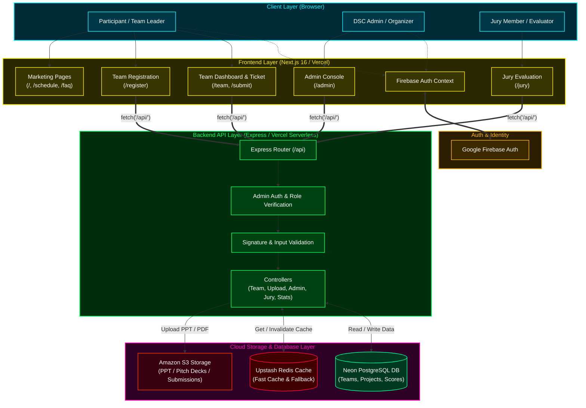

# ORIGIN '26 — System Architecture & Workflow Specifications

---

This document outlines the complete technical architecture, end-to-end data flows, and workflow diagrams for the **Origin Hackathon Platform** built for the Data Science Club (VIT Bhopal).

---

## Tech Stack Overview

| Component | Technology | Role / Purpose |
| :--- | :--- | :--- |
| **Frontend** | **Next.js 16 (App Router) + React 19 + Tailwind CSS** | High-performance UI, animations (GSAP/Lenis/Motion), reactive dashboard |
| **Authentication** | **Google Firebase Auth** | Secure Identity Management for Team Leaders, Admins, and Organizers |
| **Backend API** | **Node.js (Express) + TypeScript** | REST API layer, business logic, validation, and middleware |
| **Object Storage** | **Amazon S3 (AWS)** | Secure cloud storage for PPT/PDF pitch decks and project submission files |
| **Database** | **Neon PostgreSQL (Serverless)** | Relational database for teams, projects, scores, and admin audit logs |
| **Caching Layer** | **Upstash Redis** | Sub-millisecond distributed caching, rate-limiting, and registration state |
| **Deployment** | **Vercel** | Edge network deployment for both Next.js frontend and Serverless backend |

---

## High-Level System Architecture

